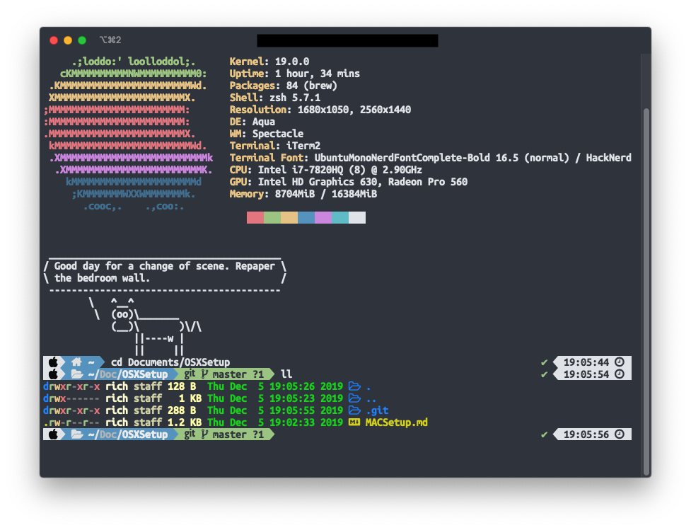

## Default config for my MBP

### Windows Manager
* [Spectacle](https://github.com/eczarny/spectacle)

### Terminal
* [iTerm](https://github.com/gnachman/iTerm2)
* [Git](https://git-scm.com/)
* [Oh-My-Zsh](https://ohmyz.sh/)
    * [PowerLevel10k theme](https://github.com/romkatv/powerlevel10k)
* [LSD](https://github.com/Peltoche/lsd)
* [HomeBrew](https://brew.sh/index_fr)
* [Neofetch](https://github.com/dylanaraps/neofetch)
* [Cowsay](https://github.com/tnalpgge/rank-amateur-cowsay)
* [Fortunate](https://www.ibiblio.org/pub/linux/games/amusements/fortune/!INDEX.html)

### Developement
* [Visual Code Studio](https://code.visualstudio.com/)
    * **Plugin Atom Keymap**
    * **Plugin Atom One Dark Theme**
    * **Plugin file-icons**
* [Docker](https://www.docker.com/)
* [Atom](https://atom.io/)
* [Xdebug](https://gist.github.com/ankurk91/22e4a07be552790a9d6a063ee1bace05)
* [Node.js](https://nodejs.org/en/)

### Database tools
* [Mysql Workbench](https://www.mysql.com/fr/products/workbench/)
* [Mongodb compasse](https://www.mongodb.com/products/compass?lang=fr-fr)
* [Dbeaver](https://dbeaver.io/)

### Hacking Tools
* [GDB - Reverse engeneering](https://www.gnu.org/software/gdb/)
* [Burp - Web](https://portswigger.net/burp)
* [Ghidra - Reverse engeneering](https://ghidra-sre.org/)
* [WhireShark - TCP sniffing](https://www.wireshark.org/)
### Chat
* [Telegram](https://telegram.org/)
* [Keybase](https://keybase.io/)
* [Slack](https://slack.com/intl/en-ch/?eu_nc=1)

### Task Manager
* [TickTick](https://ticktick.com/)
* [Trello](https://trello.com/fr)